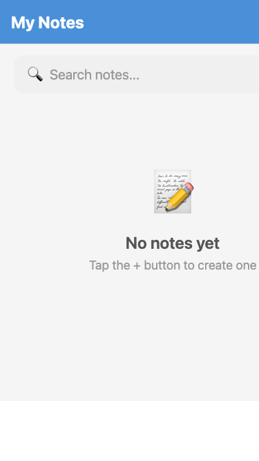
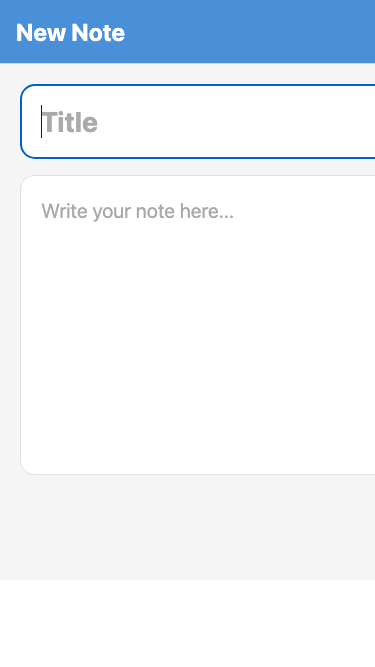

# Elder Notes 📝

A simple, accessible note-taking app designed for elderly users.

## Features

- ✅ Create, edit, and delete notes
- ✅ Search notes
- ✅ Auto-save (every 3 seconds)
- ✅ Large fonts and big tap targets
- ✅ High contrast, clean design
- ✅ No account needed — all data stored locally
- ✅ **Dark Mode** — Toggle dark/light mode in Settings, persisted across sessions
- ✅ **Note Colors** — Color-label notes (red, blue, green, yellow, purple) with a colored strip on each card
- ✅ **Pin Notes** — Pin important notes to the top of the list
- ✅ **Font Size Control** — Choose Small / Medium / Large / Extra Large in Settings
- ✅ **Haptic Feedback** — Tactile confirmation when saving or deleting notes
- ✅ **Note Count Badge** — Total note count displayed in the home screen header
- ✅ **Relative Timestamps** — "Edited 2 hours ago" style timestamps on note cards

## Design Principles

- 🔤 Large fonts (18-28px, adjustable)
- 🎯 Big tap targets (48px+ buttons)
- 🎨 High contrast colors in both light and dark mode
- 📱 Minimal UI — no clutter
- 🧓 No swipe gestures — only taps

## Screenshots & Test Results

### Notes List


### Create/Edit Note


### Test Results

| Test | Result |
|------|--------|
| ✅ Create note | PASSED |
| ✅ Note list display | PASSED |
| ✅ Multiple notes + sorting | PASSED |
| ✅ Auto-save | PASSED |
| ✅ Search/filter | PASSED |
| ✅ Back navigation | PASSED |
| ✅ Delete button appears | PASSED |

## Getting Started

```bash
# Clone the repo
git clone https://github.com/Sanjays2402/elder-notes.git
cd elder-notes

# Install dependencies
npm install

# Start the app
npx expo start
```

Then scan the QR code with Expo Go on your phone, or press:
- `i` for iOS simulator
- `a` for Android emulator
- `w` for web browser

## Tech Stack

- React Native (Expo)
- TypeScript
- AsyncStorage (local storage)
- Expo Router (file-based navigation)
- Expo Haptics (tactile feedback)

## Project Structure

```
elder-notes/
├── app/
│   ├── _layout.tsx      # Navigation layout with SettingsProvider
│   ├── index.tsx        # Home screen (note list + search + note count)
│   ├── note.tsx         # Create/Edit note screen (color picker, pin toggle)
│   └── settings.tsx     # Settings screen (dark mode, font size)
├── components/
│   ├── NoteCard.tsx     # Note card with color strip, pin icon, relative time
│   └── SearchBar.tsx    # Search bar component
├── lib/
│   ├── storage.ts       # AsyncStorage CRUD operations (color, pinned fields)
│   ├── settings.ts      # Settings context (dark mode, font size)
│   └── timeUtils.ts     # Relative timestamp utility
└── assets/              # App icons and splash screen
```

## Built with 🥔
